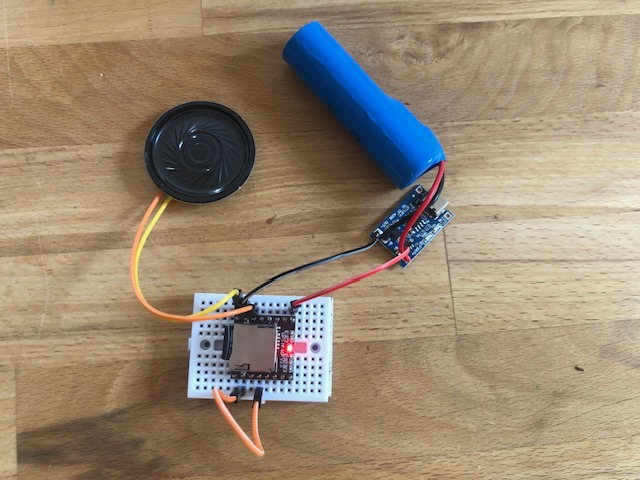

Dfplayer from AZ delivery.

The commands need to be changed when using a different brand.

Watch out your play commands by different SD card structures:

Folders 01 – 99. File names with 3 digit prefixes 001 – 255 --> cmd 0x0F
 
Folder named MP3. File names with 4 digit prefixes 0001 to 3000 --> cmd 0x12
 
Files in root directory. File names with 4 digit prefixes 0001 to 3000 --> cmd 0x03
 
Folders 01 – 15. File names with 4 digit prefixes 0001 – 3000 --> cmd 0x14

