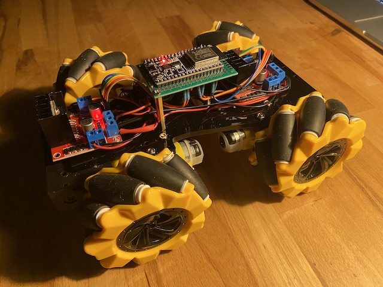
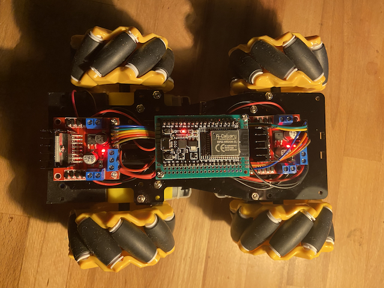

### Parts

 
4WD with 4x Mecanum wheels and 4x motors
 
1x ESP32 Wroom32 Devkit 4
 
2x L298N
 
1x ON/OFF switch
 
2x 18650 cells
 
1x 2S BMS charger
 
 

## Code Base

The fantastic code base for a 2 wheel robot is from
[donskytech](https://github.com/donskytech/micropython-wifi-robot-car/tree/main)
 
 
I adjusted it for my 4 wheel mecanum robot.
 
 

## To use the robot car, follow these steps:

1. In the boot.py change the Hotspot name and the password that belongs to your iphone Hotspot.
2. Create the Hotspot with your iPhone.
3. Press the reset button of your ESP32, the programm should log into your iphone Hotspot. You can follow the progress in the REPL.
4. In your browser, visit the IP address of your ESP and add ":5000". You can find the address in the REPL, for example: `172.20.10.2:5000`.

 
 

## Pins

### Front L298N:

IN1 --> Pin 21
 
IN2 --> Pin 19
 
IN3 --> Pin 33
 
IN4 --> Pin 25
 
ENA --> Pin 23
 
ENB --> Pin 22
 

### Rear L298N:

IN1 --> Pin 17
 
IN2 --> Pin 16
 
IN3 --> Pin 14
 
IN4 --> Pin 12
 
ENA --> Pin 26
 
ENB --> Pin 27
