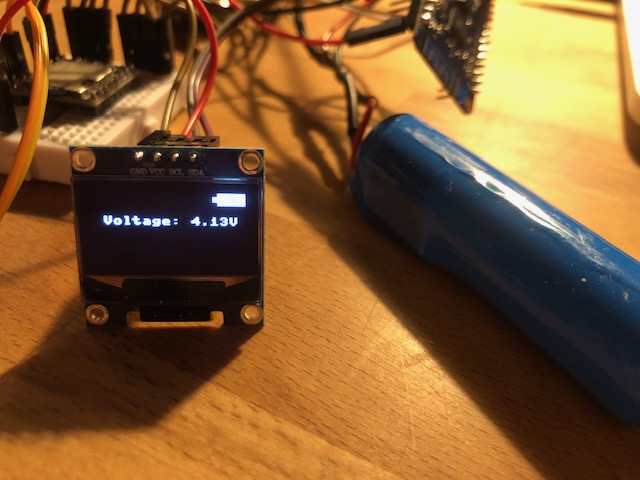

Please add the ssd1306.py to your ESP

Used battery: 18650 Li-ion

I used 100K resistors for the voltage devider on pin 5.

Check your voltage with a multimeter and adjust the +0.34 from:
voltage = adc*value * (3.3 / 4095) \_ 2 + 0.34
as needed.

