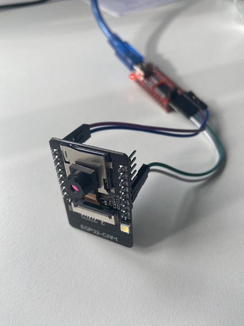

 

## Code Base

The fantastic code base is from
[shariltumin](https://github.com/FrankSiyli/esp32-cam-micropython-2022/tree/main)
 
 
I adjusted it for my 4 wheel mecanum robot.
 
 
Use the firmware from the linked Github repo
Use the GND pin next to the 5V pin and not the GND pin next to cam RX/TX.
 
 
Enter your Wifi ssid content in the wifi.py.
Load the files to your ESP32 cam.
In your browser visit the IP address shown in the repl with /live at the end.
E.g.: 172.20.10.7/live
