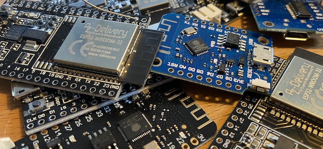

## Nerve savers:

ADC2 pins are NOT usable on some ESPs when Wifi is enabled
 
 
Wake up pins must be RTC pins
 
 
L298N: 3.3V aren't enough for logic input even when the datasheet says that it is. 5V will do it. (Tested with a USB powered Lolin32)
 
 
ESP32 Wroom: when you can't read the files on ESP32 with MU Editor, solder a 10uF capacitator between EN(+) and GND(-) of the ESP.
